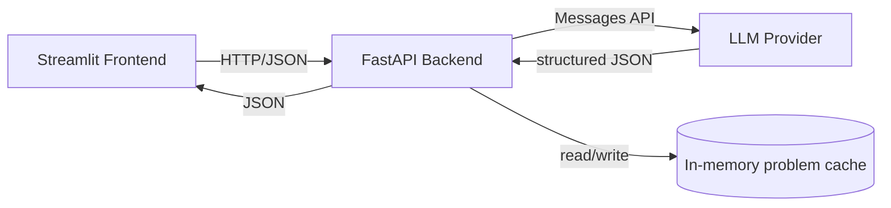

# Design Spec: Stats Practice Problem Generator

| | |
|---|---|
| **Project** | LLM-Powered Statistics Practice Problem Generator |
| **Author** | Victor Van (PM) |
| **Assignee** | Engineering (you, via Codex) |
| **Priority** | 🔴 Urgent — last-minute build, September deadline |
| **Status** | Ready for implementation |
| **Target stack** | Python, FastAPI (backend), Streamlit (frontend) |

---

## 1. Overview & Goals

We're building a web app that generates on-demand practice problems for an
intro Statistics course, using an LLM to write the problem, a step-by-step
solution, and a final answer — then lets the student attempt it, get hints,
and check their work.

**Primary goal:** a working, demoable local app: pick a topic + difficulty,
get problems, attempt them, check answers, see a running score.

**Why this architecture:** FastAPI backend as the "brain" (owns the LLM
calls, prompt templates, validation) and Streamlit frontend as a thin,
fast-to-build UI. This split means the LLM logic is testable independently
of the UI (`curl`/`httpie` against the API), which matters a lot when you're
racing a deadline and need to isolate whether a bug is "the model returned
garbage" vs. "the UI rendered it wrong."

---

## 2. Scope

### In scope (v1 — build this)
- Topic + difficulty selection
- LLM-generated problems with LaTeX-formatted math, step-by-step solutions,
  hints, and a final answer
- Answer checking (student submits an answer, gets correct/incorrect +
  feedback)
- Session score tracking (in-memory, resets on refresh — no login needed)
- Clean error handling when the LLM call fails or returns malformed output

### Explicitly out of scope (do not build, don't waste time here)
- User accounts / authentication
- Persistent storage across sessions (database) — see Stretch Goals
- Multi-user / concurrent session isolation beyond what FastAPI gives for free
- Exporting problems to PDF
- Mobile-responsive polish — Streamlit's default layout is fine

---

## 3. Core User Flow

1. Student opens the Streamlit app.
2. Sidebar: picks a **topic** (dropdown), **difficulty** (radio), and
   **number of problems** (slider, 1–5).
3. Clicks **"Generate Problems."**
4. Frontend calls `POST /api/generate` on the backend.
5. Backend builds a prompt, calls the LLM, validates the structured
   response, caches it server-side keyed by problem ID, and returns the
   problems **without the answer/solution** (so the student can't just
   peek in the browser's network tab before trying).
6. For each problem, the student sees the question rendered with LaTeX, a
   text box to type an answer, a "Show Hint" expander, and a "Check Answer"
   button.
7. On "Check Answer," frontend calls `POST /api/check` with the problem ID
   and the student's answer. Backend looks up the cached correct answer,
   compares (via a lightweight LLM-graded comparison — see §9.4), and
   returns correct/incorrect + brief feedback.
8. Score tracker in the sidebar updates (`X / Y correct`).
9. "New Set" button clears state and starts over.

---

## 4. System Architecture



| Component | Responsibility |
|---|---|
| Streamlit frontend | Renders UI, holds session state (score, current problem set, revealed hints), calls backend HTTP endpoints. Owns *no* business logic. |
| FastAPI backend | Owns prompt templates, LLM client, response validation, in-memory problem cache, answer-checking logic. This is where basically all the "hard" logic lives. |
| LLM provider | Generates problems + solutions as structured JSON (forced via tool-use / structured output, not free-text parsing). |
| In-memory cache | Maps `problem_id -> Problem` (with the solution) so the backend can grade answers without re-sending the solution to the client. Simple Python dict is enough — no DB. |

**Why not put the LLM call directly in Streamlit?** Streamlit re-runs the
entire script top-to-bottom on every interaction. If the LLM call lived in
the Streamlit script, you'd risk re-triggering expensive generation calls
on unrelated UI interactions unless you're very careful with
`st.session_state` and caching. Keeping it behind a stable HTTP API sidesteps
that whole class of bugs.

---

## 5. Tech Stack

| Layer | Choice | Notes |
|---|---|---|
| Language | Python 3.11+ | Matches your existing venv setup |
| Backend framework | FastAPI | Already decided; use `uvicorn` as the ASGI server |
| Frontend framework | Streamlit | Already decided |
| LLM SDK | `groq` (Groq API) | **$0 — genuinely free tier, no credit card required.** See §9 for why and how; the client is behind one small wrapper module so switching providers later is a one-file change |
| Data validation | `pydantic` v2 | Also what FastAPI uses natively for request/response models |
| HTTP client (frontend → backend) | `requests` | Simple, synchronous, no need for async here |
| Env management | `python-dotenv` | Loads `.env` for API keys |
| Testing | `pytest` + `httpx` (FastAPI's recommended test client) | See §13 |

---

## 6. Repository Structure

```
stats-practice-generator/
├── app/
│   ├── backend/
│   │   ├── __init__.py
│   │   ├── main.py            # FastAPI app, route definitions
│   │   ├── models.py          # Pydantic request/response schemas
│   │   ├── llm_client.py      # LLM API wrapper (provider-agnostic interface)
│   │   ├── prompts.py         # System prompt, generation template, topic taxonomy
│   │   ├── store.py           # In-memory problem cache
│   │   └── grading.py         # Answer-checking logic
│   └── frontend/
│       └── streamlit_app.py   # Single-file Streamlit UI
├── tests/
│   ├── test_models.py
│   ├── test_grading.py
│   └── test_api.py
├── .env.example
├── requirements.txt
├── README.md
└── .gitignore
```

Keep backend and frontend in one repo, one venv, one `requirements.txt` —
no need to over-engineer this into separate services given the timeline.

---

## 7. Data Models (`app/backend/models.py`)

```python
from pydantic import BaseModel, Field
from typing import Literal
from enum import Enum

class Topic(str, Enum):
    descriptive_stats = "descriptive_statistics"
    probability = "probability_basics"
    discrete_dist = "discrete_distributions"
    continuous_dist = "continuous_distributions"
    sampling_clt = "sampling_distributions_and_clt"
    confidence_intervals = "confidence_intervals"
    hypothesis_testing = "hypothesis_testing"
    regression = "correlation_and_regression"
    anova = "anova"

Difficulty = Literal["easy", "medium", "hard"]

class ProblemRequest(BaseModel):
    topic: Topic
    difficulty: Difficulty
    count: int = Field(default=1, ge=1, le=5)

class Problem(BaseModel):
    id: str                       # uuid4 string
    topic: Topic
    difficulty: Difficulty
    question: str                 # markdown + LaTeX ($...$ / $$...$$)
    hints: list[str]              # ordered, progressively more revealing
    solution_steps: list[str]     # full worked solution, LaTeX-formatted
    final_answer: str             # canonical answer, e.g. "0.842" or "reject H0"

class ProblemPublic(BaseModel):
    """What the client actually receives from /api/generate — no solution."""
    id: str
    topic: Topic
    difficulty: Difficulty
    question: str
    hints: list[str]

class ProblemBatchResponse(BaseModel):
    problems: list[ProblemPublic]

class AnswerCheckRequest(BaseModel):
    problem_id: str
    user_answer: str

class AnswerCheckResponse(BaseModel):
    correct: bool
    feedback: str
    solution_steps: list[str]     # reveal full solution regardless of correctness
    final_answer: str
```

---

## 8. Backend API Specification

| Method | Path | Purpose |
|---|---|---|
| `GET` | `/api/topics` | Return the topic taxonomy + display names, for populating the sidebar dropdown |
| `POST` | `/api/generate` | Generate a batch of problems for a topic/difficulty |
| `POST` | `/api/check` | Check a student's answer against the cached solution |
| `GET` | `/api/health` | Basic liveness check (useful when debugging why the frontend can't reach the backend) |

### `POST /api/generate`

Request:
```json
{
  "topic": "hypothesis_testing",
  "difficulty": "medium",
  "count": 3
}
```

Response:
```json
{
  "problems": [
    {
      "id": "b3f1...",
      "topic": "hypothesis_testing",
      "difficulty": "medium",
      "question": "A sample of $n=40$ light bulbs has a mean lifespan of $850$ hours...",
      "hints": ["What test statistic applies when $n > 30$?", "..."]
    }
  ]
}
```

### `POST /api/check`

Request:
```json
{ "problem_id": "b3f1...", "user_answer": "z = 2.14, reject H0" }
```

Response:
```json
{
  "correct": true,
  "feedback": "Correct — your z-statistic and conclusion both match.",
  "solution_steps": ["State H0 and Ha...", "Compute the test statistic...", "..."],
  "final_answer": "z ≈ 2.14, reject H0 at α = 0.05"
}
```

**Error cases both endpoints must handle:** LLM timeout, LLM returns
malformed/non-JSON output, unknown `problem_id` on `/api/check` (return
`404`). See §12.

---

## 9. LLM Integration & Prompt Engineering

### 9.1 Provider & method — $0 cost

Use **Groq** (console.groq.com). It's a genuinely free developer tier — no
credit card, no trial period that expires — running open models
(Llama, GPT-OSS) on their custom LPU hardware, which also happens to be
extremely fast (sub-second generations), which is nice for a live demo.

- **Model:** default to `llama-3.3-70b-versatile`. It's solid at
  instruction-following and arithmetic for intro-stats-level problems. If
  you notice math mistakes in generated problems, try `openai/gpt-oss-120b`
  instead — it's a reasoning-tuned open model, also free on Groq, and
  tends to be more careful with multi-step calculations at the cost of a
  bit more latency.
- **Free-tier limits to know about:** roughly 30 requests/minute and
  ~1,000 requests/day on `llama-3.3-70b-versatile` (limits are per-model,
  per-organization, and can shift — check `console.groq.com` for your
  account's current numbers). That's far more than you'll burn generating
  problems for a class demo, but don't loop-generate hundreds of problems
  in a script while testing.
- **Structured output:** Groq's API is OpenAI-compatible. Use
  `response_format={"type": "json_object"}` and spell out the exact JSON
  shape you want in the prompt (see §9.2/9.3) rather than relying on
  tool-calling — plain JSON mode is the most reliably supported path
  across Groq's model lineup. **Validate every response against the
  Pydantic `Problem` model** (§7); if validation fails, retry once with
  the validation error appended to the prompt ("your last response didn't
  match the schema because X — try again"), and only surface an error to
  the user if the retry also fails.
- **If you somehow blow through Groq's daily cap** (unlikely, but just in
  case mid-demo): Google's Gemini API also has a genuinely free tier
  (Flash-class models, no credit card, via `aistudio.google.com`) with
  native structured-output support via `response_schema`. It's a fine
  drop-in second option since `llm_client.py` isolates the provider — see
  §17.

### 9.2 System prompt (put this in `prompts.py`)

```
You are an experienced statistics teaching assistant writing practice
problems for an introductory undergraduate statistics course. Every
problem you write must be:
- Mathematically correct — double-check your own arithmetic before
  finalizing the answer.
- Solvable using only intro-stats-course methods (no measure theory, no
  advanced calculus).
- Realistic in framing (plausible scenarios: samples, surveys, experiments).
- Formatted with LaTeX for all math: inline as $...$, display equations as
  $$...$$.
- Free of trick wording — the difficulty should come from the statistics,
  not from ambiguous phrasing.

You will be asked to generate problems for a specific topic and difficulty
level. Follow the requested output schema exactly.
```

### 9.3 Topic taxonomy & difficulty rubric

| Topic | Easy | Medium | Hard |
|---|---|---|---|
| Descriptive statistics | Mean/median/mode/range from a small dataset | Weighted mean, outlier effects on mean vs. median | Comparing skew/spread across two datasets, interpreting boxplots |
| Probability basics | Single-event probability | Conditional probability, independence | Bayes' theorem, combined events |
| Discrete distributions | Binomial P(X=k) | Binomial cumulative, expected value | Poisson approximation, comparing two distributions |
| Continuous distributions | Normal P(X<a) via z-table | Normal, find x given percentile | Non-standard normal combined with sampling |
| Sampling distributions / CLT | Standard error of the mean | CLT applied to non-normal population | Sampling distribution of a proportion |
| Confidence intervals | CI for a mean, known σ | CI for a mean, unknown σ (t-dist) | CI for a proportion, sample-size determination |
| Hypothesis testing | One-sample z-test | One-sample t-test, p-value interpretation | Two-sample test, Type I/II error framing |
| Correlation & regression | Compute/interpret r | Simple linear regression equation | Interpret residuals, R², prediction interval |
| ANOVA | Conceptual (when to use ANOVA) | One-way ANOVA F-statistic | Interpreting ANOVA table, post-hoc reasoning |

**This taxonomy is a reasonable default for a generic intro-stats course —
swap the rows for whatever your syllabus actually covers before you rely on
this for a real assignment.** (Flagged again in §17.)

### 9.4 Answer checking

Statistics answers aren't always exact strings ("0.842" vs "≈0.84" vs
"84.2%" can all be "correct" depending on the problem). Two viable
approaches — pick based on time remaining:

- **Fast/robust for a deadline:** send the student's answer + the canonical
  answer + the problem's question back to the LLM in a small, separate
  "grading" call, and ask it to judge equivalence and return
  `{correct: bool, feedback: string}`. Costs one extra LLM call per check,
  but avoids you writing numeric-tolerance/string-matching logic per topic.
- **Cheaper, more fragile:** numeric tolerance matching (e.g., within 1% of
  canonical answer) for numeric answers, exact/fuzzy string match for
  categorical ones (e.g., "reject H0" vs "fail to reject H0"). Faster and
  free, but needs per-topic-type logic and will misjudge some correct
  phrasing.

Given the time crunch, **default to the LLM-graded approach** — it's less
code and more forgiving of answer-formatting variance, which matters more
for a demo than API cost.

---

## 10. Frontend Spec (`streamlit_app.py`)

### Layout
- **Sidebar:** topic `st.selectbox`, difficulty `st.radio`, count
  `st.slider(1, 5)`, "Generate Problems" `st.button`, a running score
  display (`st.metric("Score", f"{correct}/{attempted}")`), "New Set"
  button.
- **Main area:** loop over `st.session_state.problems`, and for each one
  render in an `st.container` or `st.expander`:
  - `st.markdown(problem.question)` — Streamlit renders `$...$` LaTeX
    natively inside `st.markdown` as long as you don't disable it.
  - `st.text_input` for the answer, keyed uniquely per problem id.
  - An `st.expander("Hint")` that reveals `hints` one at a time (button
    "Next hint" inside it, tracking how many hints have been shown in
    session state).
  - `st.button("Check Answer")` → calls `/api/check`, then
    `st.success`/`st.error` with the feedback, and reveals
    `solution_steps` via `st.markdown` once checked.

### Session state schema
```python
st.session_state.setdefault("problems", [])        # list[ProblemPublic]-like dicts
st.session_state.setdefault("results", {})          # problem_id -> AnswerCheckResponse dict
st.session_state.setdefault("hints_shown", {})       # problem_id -> int
st.session_state.setdefault("score", {"correct": 0, "attempted": 0})
```

### Backend URL
Don't hardcode `http://localhost:8000` — read it from an env var
(`BACKEND_URL`, default `http://localhost:8000`) so it's a one-line change
if you ever deploy the backend elsewhere.

---

## 11. Configuration & Environment

### `.env.example`
```
GROQ_API_KEY=your_key_here
MODEL_NAME=llama-3.3-70b-versatile
BACKEND_URL=http://localhost:8000
```

### `requirements.txt`
```
fastapi
uvicorn[standard]
streamlit
groq
pydantic>=2
python-dotenv
requests
pytest
httpx
```

### Running it (put this in the README)
```
# terminal 1
uvicorn app.backend.main:app --reload --port 8000

# terminal 2
streamlit run app/frontend/streamlit_app.py
```

---

## 12. Error Handling & Edge Cases

| Case | Handling |
|---|---|
| LLM call times out | Retry once with a short backoff; if it still fails, return `502` with a clear message; frontend shows `st.error("Couldn't generate problems — try again")` |
| LLM returns output that fails schema validation | Same as above — treat as a failure, don't attempt to "fix up" malformed JSON by hand |
| Unknown `problem_id` sent to `/api/check` | Return `404`; frontend shouldn't normally hit this unless session state is stale — show a message suggesting "New Set" |
| Empty/blank student answer submitted | Validate client-side before calling `/api/check`; don't waste an LLM grading call on nothing |
| API key missing/invalid | Fail fast at backend startup with a clear error, not on the first request |
| Free-tier rate limit hit (`429`) | Short exponential backoff (e.g. wait 2s, then 4s, max 2 retries), then fail gracefully with "Too many requests right now — wait a moment and try again" rather than a raw stack trace |

---

## 13. Testing Plan

- **`test_models.py`** — Pydantic models accept valid input, reject invalid
  topic/difficulty/count values.
- **`test_grading.py`** — mock the LLM client, verify grading logic returns
  expected `correct`/`feedback` shape for a few canned cases.
- **`test_api.py`** — use FastAPI's `TestClient`/`httpx` to hit
  `/api/topics`, `/api/generate` (with the LLM client mocked — don't burn
  real API calls in tests), `/api/check`.
- **Manual QA checklist before demo:**
  - [ ] Generate 1 problem per topic at each difficulty at least once
  - [ ] Verify LaTeX renders (no stray `$` or raw backslashes on screen)
  - [ ] Submit a correct and an incorrect answer, confirm feedback matches
  - [ ] Refresh the page mid-session, confirm it resets cleanly (no crash)
  - [ ] Kill the backend while frontend is running, confirm frontend shows
        a readable error instead of a stack trace

---

## 14. Non-Functional Requirements

- **Latency:** problem generation should complete in well under ~10s for
  up to 5 problems; if it's slower, show `st.spinner("Generating...")` so
  it doesn't look frozen.
- **Cost:** each `/api/generate` call is 1 LLM call; each `/api/check` call
  is 1 LLM call (grading). No need to optimize further for a class project,
  but be aware the "check answer" flow costs a call per attempt.
- **No concurrency requirements** — this is a single-user local demo, not
  a production multi-tenant service.

---

## 15. Build Plan (suggested order, given the timeline)

| Phase | Tasks | Est. time |
|---|---|---|
| 0. Scaffolding | Repo structure, venv, `requirements.txt`, `.env` | 20–30 min |
| 1. Backend core | Pydantic models, `llm_client.py`, `prompts.py`, `/api/topics` + `/api/generate`; test with `curl`/`httpie` before touching the frontend at all | 60–90 min |
| 2. Frontend skeleton | Streamlit sidebar + generate button wired to backend, render one problem's question with LaTeX | 45–60 min |
| 3. Answer checking | `/api/check` endpoint + grading logic, wire up "Check Answer" button and score tracker | 45–60 min |
| 4. Hints + polish | Hint reveal UX, solution reveal after check, error states from §12 | 30–45 min |
| 5. Test & demo prep | Run through the manual QA checklist, fix rough edges, write the README | 30 min |

Build and test the backend in isolation first (Phase 1) before wiring up
Streamlit — it's much faster to debug a malformed LLM response via `curl`
than through the UI.

---

## 16. Definition of Done

- [ ] Student can select topic + difficulty + count and get problems
- [ ] Problems render correctly with LaTeX, no visible markdown/LaTeX artifacts
- [ ] Student can submit an answer and get correct/incorrect + feedback
- [ ] Full solution is revealed after checking
- [ ] Hints are available before checking
- [ ] Score tracker updates correctly across multiple problems
- [ ] Backend failures (timeout, bad LLM output) don't crash the frontend
- [ ] README has working run instructions

---

## 17. Assumptions & Open Questions

Flagging these because they were decided by default rather than by you —
adjust before treating this as final:

- **Topic taxonomy (§9.3)** assumes a generic intro-stats course. Swap in
  the actual topics/order from your syllabus if they differ.
- **LLM provider** defaults to Groq's free tier (§9.1) specifically to
  keep this at $0 — no credit card, no paid API. The trade-off is you're
  on an open model (Llama/GPT-OSS) rather than a frontier one, and you're
  bound by free-tier rate limits (~30 RPM / ~1,000 req/day). If those ever
  become a real constraint, Gemini's free tier (also $0, also no card) is
  the next thing to try — swap `llm_client.py`'s implementation, since
  the rest of the app only depends on `generate_problems()` and
  `grade_answer()` keeping the same function signatures.
- **No persistence** — closing the browser tab loses all progress. Called
  out as out-of-scope in §2; revisit only if you have spare time (§18).
- **Answer grading is LLM-based**, not exact-match — meaning grading is
  only as reliable as the grading prompt. Worth a few manual spot-checks
  during QA (§13).

---

## 18. Stretch Goals (only if Phases 0–5 are done early)

- Persist problems/scores to SQLite via SQLAlchemy so a session survives a
  refresh.
- "Explain differently" button that re-prompts the LLM for an alternative
  explanation if the first solution wasn't clear.
- Difficulty auto-adjusts based on running accuracy (harder after 3
  correct in a row, easier after 2 wrong).
- Export a generated problem set to a printable PDF.

---

## Appendix: Manual backend smoke-test commands

```bash
# health check
curl http://localhost:8000/api/health

# list topics
curl http://localhost:8000/api/topics

# generate problems
curl -X POST http://localhost:8000/api/generate \
  -H "Content-Type: application/json" \
  -d '{"topic": "hypothesis_testing", "difficulty": "medium", "count": 2}'

# check an answer (use a real problem_id from the response above)
curl -X POST http://localhost:8000/api/check \
  -H "Content-Type: application/json" \
  -d '{"problem_id": "REPLACE_ME", "user_answer": "z = 2.14, reject H0"}'
```
